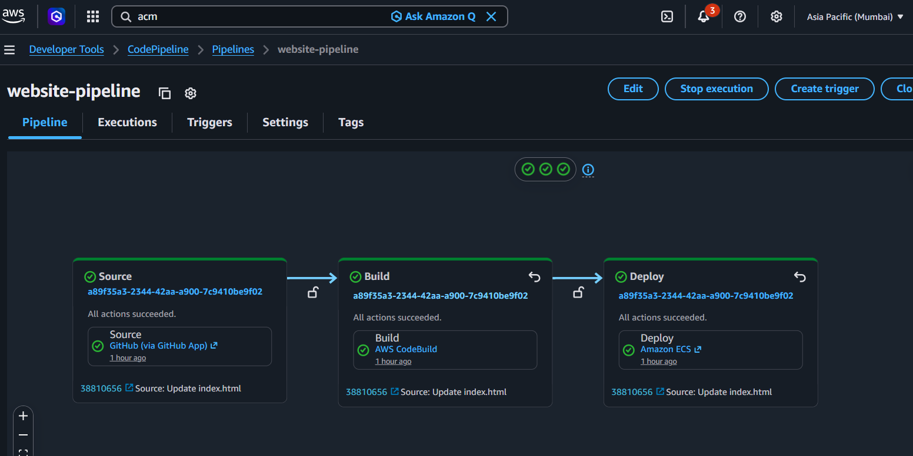

# ecs-fargate-pipeline

## Project Overview

This project demonstrates the deployment of a containerized web application on AWS ECS using Fargate. The application is packaged using Docker and stored in Amazon ECR for container image management.

A CI/CD pipeline using GitHub, AWS CodePipeline, and CodeBuild automates the application build and deployment process. New code changes are automatically built into a Docker image, pushed to ECR, and deployed to ECS.

The application is exposed through an Application Load Balancer and uses native ECS Blue/Green deployments with separate Blue and Green target groups for safer application updates.

HTTPS is configured using AWS Certificate Manager, while Amazon Route 53 is used to connect the application to a custom domain. CloudWatch is used for container logging and monitoring.

---

## ⚙️ Architecture Flow

```text
Developer
    │
    ▼
GitHub Repository
    │
    ▼
AWS CodePipeline
    │
    ▼
AWS CodeBuild
    │
    ├── Docker Build
    ├── Docker Image
    └── Push Image
           │
           ▼
      Amazon ECR
           │
           ▼
       Amazon ECS
         Fargate
           │
      ┌────┴────┐
      ▼         ▼
    Blue      Green
  Target      Target
   Group       Group
      │         │
      └────┬────┘
           ▼
 Application Load Balancer
           │
           ▼
       Route 53
           │
           ▼
 https://ecs.deployops.in
```

---

## 🏗️ Architecture


---

## 🌐 Website


---

## Pipeline



---

## 🛠️ Tools & Technologies Used

- AWS ECS
- AWS Fargate
- Amazon ECR
- Application Load Balancer
- AWS CodePipeline
- AWS CodeBuild
- GitHub
- Docker
- AWS Certificate Manager
- Amazon Route 53
- Amazon CloudWatch
- IAM
- Native ECS Blue/Green Deployment

---

## 🎯 Outcome

- Successfully containerized and deployed a web application using Docker
- Deployed the application on AWS ECS Fargate
- Created and managed Docker images using Amazon ECR
- Built an automated CI/CD pipeline using GitHub, CodePipeline, and CodeBuild
- Implemented native ECS Blue/Green deployments
- Configured Application Load Balancer for application traffic
- Configured HTTPS using AWS Certificate Manager
- Connected a custom domain using Route 53
- Configured CloudWatch logging for ECS containers
- Automated Docker image deployment using `buildspec.yml` and `imagedefinitions.json`

---

## 📚 Key Learnings

- AWS ECS and Fargate architecture
- Docker containerization
- Amazon ECR
- ECS Services and Task Definitions
- Application Load Balancer
- Target Groups and Health Checks
- Native ECS Blue/Green Deployments
- AWS CodePipeline
- AWS CodeBuild
- CI/CD automation
- buildspec.yml
- imagedefinitions.json
- AWS Certificate Manager
- Route 53
- CloudWatch Logs
- IAM roles and permissions
- Container deployment troubleshooting
- AWS networking and traffic flow


---

## 👨‍💻 Author

**Sanjeevan Varma**

GitHub: https://github.com/sanjeevanvarma

LinkedIn: https://www.linkedin.com/in/sanjeevan-varma-indukuri-90943529b/
